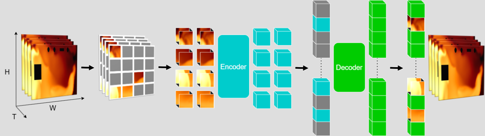

## Model Archietecture



## Environment Setup
The environment setup for this project follows the same procedure as the official **[MAE GitHub repository](https://github.com/facebookresearch/mae)**.  
You can set up the environment in the following way:

- Visit the [MAE GitHub repository](https://github.com/facebookresearch/mae).  
- Refer to the `INSTALL.md` file and follow the steps provided.

## Data Preprocessing

The data preprocessing step can be performed using the **`out2csv.ipynb`** notebook.  
This script converts the raw sensor data into a format suitable for model input.

- The raw dataset (e.g., `1in3out-lvlc-left.csv`) contains sensor values over time.  
- Each row includes a `time` field and 16 sensor readings (`S1`–`S16`).  
- The goal is to transform each row into a **4 × 4 matrix**, where each element corresponds to a sensor value after **log normalization**.  
- The processed data is saved as separate `.csv` files (one file per time step), which are directly usable as model inputs.


## Training

The training process follows the implementation in **`main_pretrain.py`**.  
All training parameters can be configured through command-line arguments when running the training script.


Below is an example training command used in this project:

```bash
python run_pretrain.py \
  --batch_size 8 \
  --model mae_vit_base_patch1 \
  --mask_ratio 0.5 \
  --epochs 401 \
  --warmup_epochs 40 \
  --blr 1.5e-4 \
  --weight_decay 0.05 \
  --path_to_data_dir /mnt/d/haoxiangbiya/mae_st/biya_exp_data/dataset_ablation55/train \
  --accum_iter 10 \
  --input_size 4 \
  --output output_dir_ablation55 \
  --num_frames 8 \
  --decoder_embed_dim 512 \
  --decoder_depth 8 \
  --t_patch_size 1 \
  --sampling_rate 5 \
  --pred_t_dim 8 \
  --sep_pos_embed
```

## Testing

The testing and visualization process is implemented in **`visualize.ipynb`**.  
This notebook loads a trained checkpoint, runs inference on the preprocessed dataset, and exports the predicted results with error analysis.

- Purpose
    - Evaluate the trained model on different datasets (CFD and real-world experiments).  
    - Compare **predictions vs. ground truth** at each sensor location.  
    - Output error metrics such as **relative error**, both per-sensor and on average.  

- Processing Steps
    1. **Load dataset**
        - The script reads a directory of preprocessed `.csv` files (e.g., `biya_exp_data/dataset_ablation55/position_change_cfd_test`).  
        - Each CSV file contains a `4 × 4` normalized sensor matrix at a given time step.

    2. **Load trained model checkpoint**
        - A helper function `prepare_model()` loads a saved checkpoint (e.g., `output_dir_ablation55/checkpoint-00300.pth`).  
        - The model architecture and parameters are initialized and set to evaluation mode.

    3. **Run inference**
        - Input sequences of frames (`num_frames = 8`) are passed through the model.  
        - The model predicts masked regions based on the specified `mask_ratio` or a custom sensor mask.  
        - The predictions are **inverse log-normalized** to return to the original concentration scale.

    4. **Reconstruction and error analysis**
        - Predicted values are combined with ground-truth unmasked regions.  
        - Relative error is computed **only within masked regions**:  
            $$
            \text{Relative Error} = \frac{|x_{\text{true}} - x_{\text{pred}}|}{x_{\text{true}}}
            $$
        - The script records **per-sensor predictions, ground truth values, and relative errors**.

    5. **Export results**
        - The final output (`output.csv`) contains:
            - `sensorX`: Predicted values for each sensor.  
            - `origin_X`: Ground truth values.  
            - `mask_X`: Relative error (only for masked sensors).  
            - `average`: Average relative error across all masked sensors.  
            - `max`: Maximum relative error.  
            - `filename`: Source file used for evaluation.  

        Example:
        ```csv
        sensor1,sensor2,...,origin_1,origin_2,...,mask_1,mask_2,...,average,max,filename
        ...
